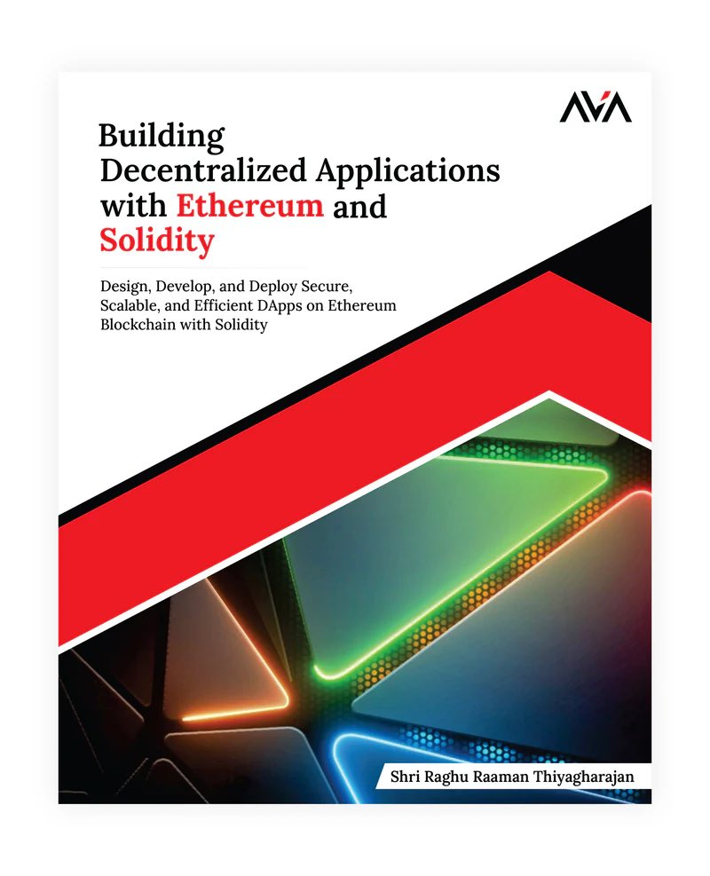

# Hi there, I'm Shri Raghu Raaman Thiyagharajan

```
 ██████╗ ██╗  ██╗   ██████╗  █████╗  ██████╗ ██╗  ██╗██╗   ██╗
██╔═████╗╚██╗██╔╝   ██╔══██╗██╔══██╗██╔════╝ ██║  ██║██║   ██║
██║██╔██║ ╚███╔╝    ██████╔╝███████║██║  ███╗███████║██║   ██║
████╔╝██║ ██╔██╗    ██╔══██╗██╔══██║██║   ██║██╔══██║██║   ██║
╚██████╔╝██╔╝ ██╗   ██║  ██║██║  ██║╚██████╔╝██║  ██║╚██████╔╝
 ╚═════╝ ╚═╝  ╚═╝   ╚═╝  ╚═╝╚═╝  ╚═╝ ╚═════╝ ╚═╝  ╚═╝ ╚═════╝ 
```

<p align="center">
  
</p>

<p align="center">
  
  
</p>

<p align="center">
  <a href="https://book.0xraghu.com/" target="_blank">
    
  </a>
  <a href="https://x.com/0xRaghu" target="_blank">
    
  </a>
  <a href="https://www.linkedin.com/in/0xRaghu/" target="_blank">
    
  </a>
  <a href="mailto:hi@0xraghu.com">
    
  </a>
</p>

---

## 🚀 About Me

> **Bringing clarity to Web3 complexity** - I empower developers with the tools, support, and knowledge to build tomorrow's decentralized applications.

As a **Senior Developer Relations Engineer at Kava Chain**, I specialize in bridging cutting-edge protocols with real-world innovation. My journey spans hands-on smart contract development—crafting secure, upgradable solutions and contributing to standards like **ERC-20, ERC-721, and ERC-1155** for NFTs, gaming, and DeFi—to fostering ecosystem growth in the dynamic Web3 landscape.

### 📚 My Book: "Building Decentralized Applications with Ethereum and Solidity"

<p align="center">
  <a href="https://book.0xraghu.com/" target="_blank">
    
  </a>
</p>

This practical guide distills my expertise into a roadmap for developers, simplifying blockchain development and empowering readers to create impactful DApps.

**📖 Get your copy:**
- [Amazon International](https://rb.gy/z65gz2)
- [Amazon India](https://rb.gy/wg3gxa)

### 🎯 What I Do at Kava Chain

- 🔧 **Integrating tools** and forging partnerships with validators, RPC providers, and analytics platforms
- 🚀 **Supporting high-impact launches** like HARD.fun and Kava DeAI
- 📖 **Crafting documentation, tutorials, and FAQs** to elevate the developer experience
- 💰 **Leading initiatives** like the $750M Kava Rise fund and a $300M incubation fund
- 🤝 **Powering integrations** like Kinetix and WAGMI

📍 **Location:** Toronto, Ontario, Canada

---

## 🛠️ Tech Stack

### Blockchain


### Frontend


### Backend & Tools


---

## 📊 GitHub Stats

<p align="center">
  
  
</p>

<p align="center">
  
</p>

<p align="center">
  
</p>

---

## 🌟 Featured Projects

<table>
  <tr>
    <td width="50%">
      <h3 align="center">🔄 Ether Wei Converter</h3>
      <div align="center">
        <a href="https://chromewebstore.google.com/detail/ether-%E2%86%94-gwei-%E2%86%94-wei-conver/mpcihihcafeegcadflidhmhgmbplpkeo" target="_blank">
          
        </a>
        <p><strong>Chrome extension for Ethereum unit conversion</strong></p>
        <p>Simple tool to convert between Ether, GWei, and Wei</p>
        <p>
          
          
        </p>
      </div>
    </td>
    <td width="50%">
      <h3 align="center">🤖 Claude Code Updater</h3>
      <div align="center">
        <a href="https://www.npmjs.com/package/claude-code-updater" target="_blank">
          
        </a>
        <p><strong>Automated Claude Code CLI updater</strong></p>
        <p>Keep your Claude Code CLI up to date automatically</p>
        <p>
          
          
        </p>
      </div>
    </td>
  </tr>
  <tr>
    <td width="50%">
      <h3 align="center">💎 Gemini CLI Updater</h3>
      <div align="center">
        <a href="https://www.npmjs.com/package/gemini-cli-updater" target="_blank">
          
        </a>
        <p><strong>Automated Gemini CLI updater</strong></p>
        <p>Keep your Google Gemini CLI tools updated effortlessly</p>
        <p>
          
          
        </p>
      </div>
    </td>
    <td width="50%">
      <h3 align="center">📚 Kava Documentation</h3>
      <div align="center">
        <a href="https://docs.kava.io" target="_blank">
          
        </a>
        <p><strong>Official Kava Chain documentation</strong></p>
        <p>Comprehensive developer documentation for Kava blockchain</p>
        <p>
          
          
        </p>
      </div>
    </td>
  </tr>
  <tr>
    <td width="50%">
      <h3 align="center">🏛️ Alkemi Earn Contracts</h3>
      <div align="center">
        <a href="https://alkemi.network" target="_blank">
          
        </a>
        <p><strong>Decentralized lending protocol</strong></p>
        <p>Smart contracts for seamless crypto lending and borrowing</p>
        <p>
          
          
        </p>
      </div>
    </td>
    <td width="50%">
      <h3 align="center">🎨 NFT Marketplace</h3>
      <div align="center">
        <a href="https://github.com/0xRaghu/NFT-Marketplace" target="_blank">
          
        </a>
        <p><strong>Full-stack NFT marketplace</strong></p>
        <p>Complete marketplace supporting ERC-721 and ERC-1155 standards</p>
        <p>
          
          
        </p>
      </div>
    </td>
  </tr>
</table>

---

## 💬 Let's Connect!

I thrive at the intersection of **technology and community**, connecting protocol teams with developers to deliver feedback, foster collaboration, and fuel ecosystem growth. 

**Passionate about unlocking blockchain's potential?** Let's build the next wave of decentralized innovation together! 🚀

<p align="center">
  <a href="mailto:hi@0xraghu.com">
    
  </a>
  <a href="https://www.linkedin.com/in/0xRaghu/" target="_blank">
    
  </a>
  <a href="https://0xraghu.com" target="_blank">
    
  </a>
</p>

---

<p align="center">
  
</p>